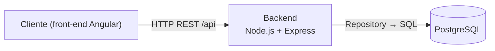
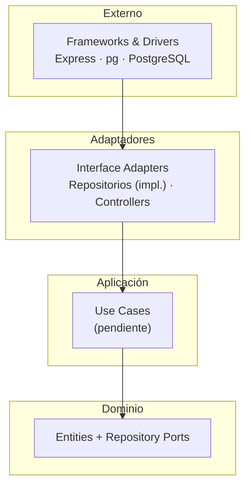
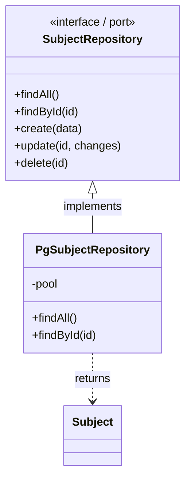
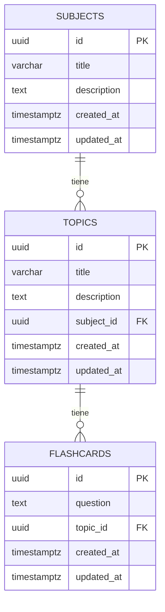

# Arquitectura — Backend (Active Recall)

Documento técnico del **backend**. Describe cómo está construido y por qué.
El cliente (front-end Angular) vive en un repositorio aparte y consume esta API.

- [1. Visión general](#1-visión-general)
- [2. Clean Architecture](#2-clean-architecture)
- [3. Capas y responsabilidades](#3-capas-y-responsabilidades)
- [4. Capa de persistencia desacoplada](#4-capa-de-persistencia-desacoplada)
- [5. Modelos de dominio](#5-modelos-de-dominio)
- [6. Esquema de base de datos](#6-esquema-de-base-de-datos)
- [7. Decisiones y trade-offs](#7-decisiones-y-trade-offs)
- [8. Roadmap técnico](#8-roadmap-técnico)

---

## 1. Visión general



El backend es una API REST desacoplada del cliente. Internamente sigue Clean
Architecture para aislar la lógica de negocio de los detalles de infraestructura
(framework HTTP y base de datos).

---

## 2. Clean Architecture

La **regla de dependencia** es la base: las capas externas dependen de las internas,
**nunca al revés**.



El **dominio** (entidades + interfaces de repositorio) no conoce Express ni `pg`.
Es testeable de forma aislada y resistente a cambios de infraestructura.

---

## 3. Capas y responsabilidades

| Capa               | Responsabilidad                                          | Conoce a...    |
| ------------------ | -------------------------------------------------------- | -------------- |
| **Domain**         | Entidades, reglas de negocio y contratos de repositorio  | Nada externo   |
| **Infrastructure** | Conexión a BD, adaptadores de repositorio, cableado      | Domain         |
| **app.js**         | Configuración de Express, rutas y arranque               | Infrastructure |

```
src/
├── domain/                    # ← Núcleo. Sin dependencias externas.
│   ├── entities/              #   Reglas de negocio de cada entidad.
│   └── repositories/          #   PORTS: contratos de persistencia (abstractos).
└── infrastructure/            # ← Detalles técnicos (intercambiables).
    ├── database/              #   Conexión (driver `pg`).
    ├── persistence/postgres/  #   ADAPTERS: implementación de los ports.
    └── container.js           #   Composition root.
```

---

## 4. Capa de persistencia desacoplada

Resuelve el requisito **"si cambiamos de base de datos, que no se afecten los
modelos"** mediante el **patrón Repository** con inversión de dependencias.

1. **Ports (interfaces)** en `domain/repositories/`: definen *qué* operaciones
   existen (`findAll`, `findById`, `create`, `update`, `delete`), trabajando siempre
   con **entidades de dominio**, nunca con filas SQL.
2. **Adapters** en `infrastructure/persistence/postgres/`: traducen entre SQL y
   entidades con `Entity.fromRow()`. Son los únicos que escriben SQL.
3. **Composition root** (`container.js`): el **único** archivo que decide qué
   implementación se usa.



**Cómo cambiar de base de datos (ej. a MySQL):**

1. Crear `infrastructure/persistence/mysql/MySql*Repository.js` implementando los
   mismos ports.
2. Crear la conexión equivalente en `infrastructure/database/`.
3. Cambiar los `require`/instancias en `container.js`.

El dominio, los casos de uso y los controladores **no cambian ni una línea**.

---

## 5. Modelos de dominio

Cada entidad (`domain/entities/`):

- Valida sus **invariantes** en el constructor (espejo de `NOT NULL` / `CHECK`).
- `static fromRow(row)`: mapea `snake_case` (BD) → `camelCase` (dominio).
- `toJSON()`: define el contrato de salida de la API.

```js
// backend/src/domain/entities/Subject.js
class Subject {
  constructor({ id, title, description = null, createdAt, updatedAt }) {
    if (!title || String(title).trim().length === 0) {
      throw new Error('Subject.title is required and cannot be blank.');
    }
    // ...
  }
  static fromRow(row) { /* created_at → createdAt ... */ }
  toJSON() { /* forma expuesta por la API */ }
}
```

| Entidad     | Campos de dominio                                          |
| ----------- | --------------------------------------------------------- |
| `Subject`   | `id`, `title`, `description`, `createdAt`, `updatedAt`     |
| `Topic`     | `id`, `title`, `description`, `subjectId`, `createdAt`, `updatedAt` |
| `Flashcard` | `id`, `question`, `topicId`, `createdAt`, `updatedAt`     |

---

## 6. Esquema de base de datos



Características de los scripts (`sql/`):

- **UUID** como PK (`gen_random_uuid()`): apto para sistemas distribuidos/nube y
  coincide con `crypto.randomUUID()` del cliente.
- **`created_at` / `updated_at`** automáticos con trigger `set_updated_at()`.
- **FK con `ON DELETE CASCADE`** e **índices** en las claves foráneas.
- **`CHECK`** para impedir títulos/preguntas en blanco.
- **Idempotentes** (`IF NOT EXISTS`, `CREATE OR REPLACE`).

---

## 7. Decisiones y trade-offs

| Decisión                           | Por qué                                            | Trade-off aceptado                    |
| ---------------------------------- | -------------------------------------------------- | ------------------------------------- |
| Clean Architecture                 | Independencia de BD y framework; testabilidad       | Más estructura desde el inicio        |
| Patrón Repository (ports/adapters) | Cambiar de BD sin tocar dominio                    | Una capa extra de indirección         |
| UUID como PK                       | Escalable a nube/distribuido; coincide con el front | Ligeramente más pesado que enteros    |
| Migraciones SQL manuales           | Control total y simplicidad inicial                | Sin versionado automático (por ahora) |
| Express minimalista                | Arrancar rápido y sin sobrecarga                   | Se añadirá estructura al crecer       |

---

## 8. Roadmap técnico

1. **Casos de uso** (`src/application/use-cases/`): `CreateSubject`,
   `ListTopicsBySubject`, etc., que orquestan entidades + repositorios.
2. **Controladores y rutas** REST: `/api/subjects`, `/api/topics`, `/api/flashcards`.
3. **Módulo de repaso**: añadir campos de agenda a `flashcards`
   (`answer`, `next_review_date`, `interval_index`) y el motor de repetición espaciada.
4. **Notificaciones** (cron job): servicio que consulta qué repasar hoy y avisa.
5. **Testing**: pruebas unitarias del dominio y de los casos de uso.
