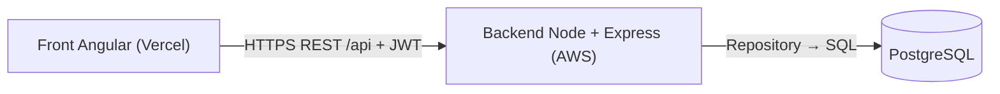
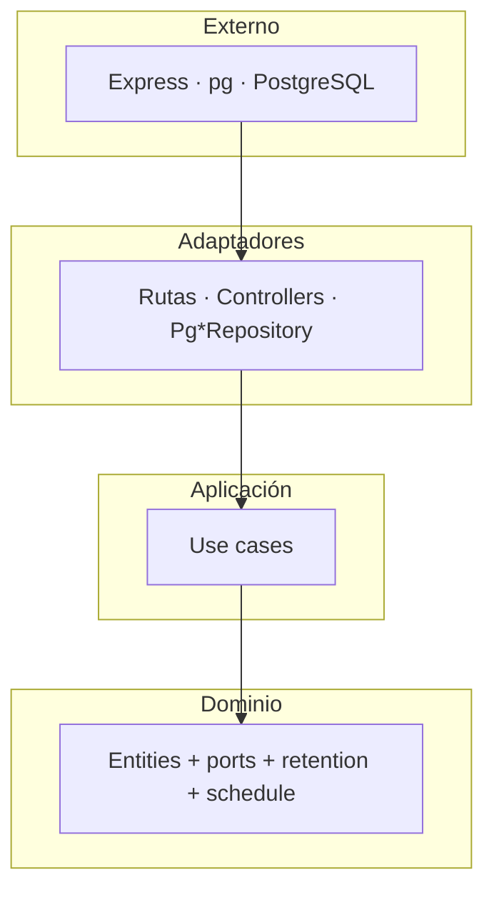
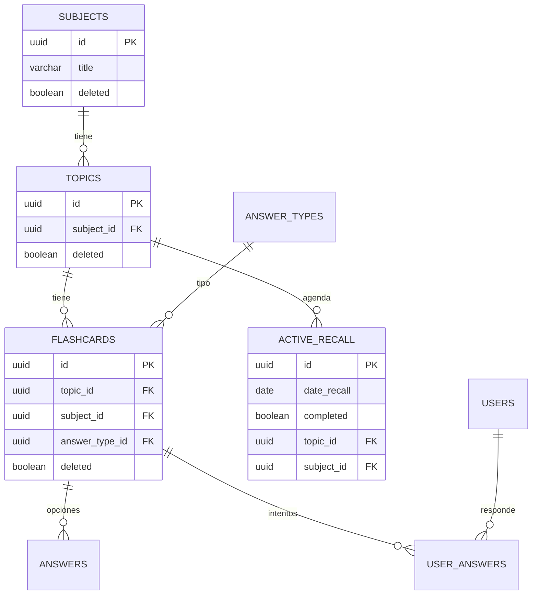

# Arquitectura — Backend (Active Recall)

Documento técnico del **backend**. El cliente Angular vive en otro repositorio
y consume esta API.

- [1. Visión general](#1-visión-general)
- [2. Clean Architecture](#2-clean-architecture)
- [3. Capas y responsabilidades](#3-capas-y-responsabilidades)
- [4. Persistencia desacoplada](#4-persistencia-desacoplada)
- [5. Modelo de dominio](#5-modelo-de-dominio)
- [6. Esquema de base de datos](#6-esquema-de-base-de-datos)
- [7. Auth y sobre HTTP](#7-auth-y-sobre-http)
- [8. Repaso y retención](#8-repaso-y-retención)
- [9. Decisiones](#9-decisiones)
- [10. Cómo se prueba](#10-cómo-se-prueba)

---

## 1. Visión general



API REST desacoplada del cliente. Clean Architecture aísla el dominio de Express
y de `pg`.

---

## 2. Clean Architecture

Las capas externas dependen de las internas, **nunca al revés**.



---

## 3. Capas y responsabilidades

| Capa               | Carpeta                     | Conoce a…        |
| ------------------ | --------------------------- | ---------------- |
| Domain             | `src/domain/`               | Nada externo     |
| Application        | `src/application/use-cases/`| Domain           |
| Interface adapters | `src/interfaces/http/`      | Application      |
| Infrastructure     | `src/infrastructure/`       | Domain           |
| Composition root   | `container.js` + `createApp.js` | Todo          |

`app.js` solo arranca el puerto, conecta el pool y cierra con SIGINT/SIGTERM.

---

## 4. Persistencia desacoplada

1. **Ports** en `domain/repositories/`: `findAll`, `findById`, `create`, `update`,
   `delete` (soft), más operaciones específicas (`findByTopicId`, `markCompleted`…).
2. **Adapters** `Pg*Repository`: el único SQL.
3. **`container.js`**: elige PostgreSQL. Los tests HTTP usan `test/helpers/memoryRepos.js`
   con los mismos use cases.

Para cambiar de motor: nuevos adapters + pool, y un cambio en `container.js`.

Los borrados son **lógicos** (`deleted = true`). Los repositorios de lectura
añaden `deleted = false` y exigen que el tema y la materia padres también estén
vivos.

---

## 5. Modelo de dominio

Cada entidad valida invariantes en el constructor, mapea con `fromRow()` y sale
por API con `toJSON()` en **camelCase**.

| Entidad        | Notas |
| -------------- | ----- |
| `User`         | `enabled`; login solo si está activo |
| `Subject`      | Título obligatorio |
| `Topic`        | Requiere `subjectId` |
| `Flashcard`    | `topicId` + `subjectId` denormalizado + `answerTypeId` |
| `Answer`       | `topicId` y `subjectId` denormalizados |
| `ActiveRecall` | Un hito de agenda del **tema** (no de la pregunta) |
| `UserAnswer`   | `attemptId` agrupa un intento; en la app es el `id` del recall |

Tipos de respuesta: `single_choice` (exactamente una correcta),
`multiple_choice` (al menos una), `open_answer` (una respuesta esperada).

---

## 6. Esquema de base de datos



UUID como PK, `created_at` / `updated_at` con trigger, FKs, `CHECK` de textos no
vacíos, scripts idempotentes. El orden está en el [README](../README.md#base-de-datos).

---

## 7. Auth y sobre HTTP

- Registro / login públicos. El resto de `/api` pasa por `requireAuth`.
- Contraseña: política en `passwordPolicy.js`, hash **scrypt** con
  `PASSWORD_PEPPER`.
- Sesión: JWT en `Authorization: Bearer`.
- Éxito: `{ data, msg }`. Error: `{ data: null, msg, code? }` con status HTTP
  del `AppError` (`ValidationError` 400, `NotFoundError` 404, etc.).

CORS está abierto (`cors()`) para que el front en `*.vercel.app` pueda llamar a
la API en AWS sin configuración extra. En un entorno más estricto se puede
restringir el origen.

---

## 8. Repaso y retención

Al **crear un tema** (`CreateTopic`) se insertan, en transacción: el tema, cada
pregunta con sus respuestas, y **7** `active_recall` según `recallSchedule.js`.

`completed` en el recall = el alumno terminó de contestar **todas** las
preguntas de esa sesión. No significa “todas correctas”.

**Retención** (`domain/retention.js`), usada por `GetDashboardStats`:

```
R(t) = 100 × exp(−t / S)
S    = 7 × 2.5^n
```

- `n`: número de recalls del tema con `completed === true`.
- `t`: días entre el último recall completado (o `createdAt` del tema) y “hoy”.
- Si `n ≥ 7` → 100 % fijo.
- Si el tema es de hoy y `n = 0` → `t = 0` → **100 %** (aún no ha empezado el olvido).
- El dashboard publica el promedio entre temas, o `null` si no hay ninguno.

Las cards de materia cuentan **preguntas en proceso**: flashcards cuyo tema tiene
`n < 7`. “Para repasar” en la card son las preguntas de temas con un recall
pendiente cuya fecha es hoy o anterior.

---

## 9. Decisiones

| Decisión                    | Por qué                                      | Trade-off |
| --------------------------- | -------------------------------------------- | --------- |
| Clean Architecture          | Cambiar de BD o de HTTP sin tocar reglas     | Más carpetas |
| Soft delete                 | Recuperar y no romper historial              | Los GET siempre filtran |
| FKs denormalizados          | Listados y cascadas más simples              | Hay que copiar `subject_id` al crear |
| Repaso a nivel de **tema**  | Una sesión = todas las preguntas del tema    | No hay agenda independiente por pregunta |
| SQL manual (`sql/NNN_*.sql`)| Control total, sin ORM                       | Hay que aplicarlos a mano en cada entorno |
| JWT + pepper en env         | Sin servicio de secretos extra en el MVP     | Rotar pepper invalida claves |

---

## 10. Cómo se prueba

```bash
npm test
```

- Unitarias de dominio, use cases y adapters (con pool falso).
- HTTP de integración contra `createMemoryApp()` (mismos controladores, repos en
  memoria). No hace falta PostgreSQL para la suite.

Los mensajes de aserción van en inglés; los `msg` de la API, en español.
